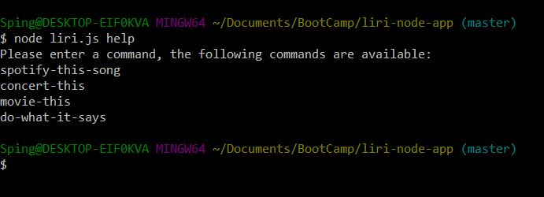
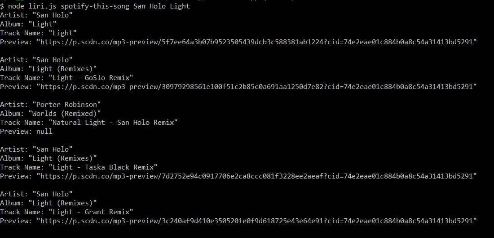
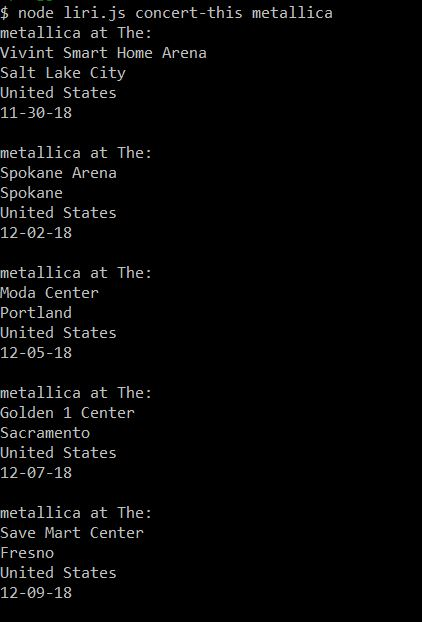

# **liri-node-app**

## Liri is a 'Language'  interpritation and recognition interface     

### What this means to you

**Liri is a node.JS app that integrates with the Spotify API, OMDB API and Bands in town API**

*How do I use this?*

Use LIRI with a command line interface, there is a number  of commands you  can use.

#### Commands
**spotify-this-song**
*Returns 5 songs from the title entered after the commands*

**movie-this**
*Returns a Movie from the command line arguments*

**concert-this**
*Pulls up 5 concerts from the artist entered as a command line argument*

**do-what-it-says**
*Reads the file **random.txt** and returns each command and input from the file**

**help**
*Returns all available commands for Liri! Use this if you forget what Liri can do*

help looks like this:

#### How should my string look?  
**Format your query like so:** *node liri.js spotify-this-song This Love*

The above will return five songs with *this love* in the title.
Special note!: for *spotify-this-song* You can enter the artist as an argument followed by the song as well, that will be more accurate!
Use string replacing the third argument with whichever command you'd like to use like the following:

*node liri.js movie-this Coco*

See the screenshots below!:

## Liri requires some packages!

If you'd like to clone Liri remember to run npm install or else you're gonna have a bad time.

Packages used: moment, axios, dotenv, and node-spotify-api
I'd like to thank the devs for their work on each one as well.

Since dotenv is present you  also have to provide your own .env file! Get your API keys!
